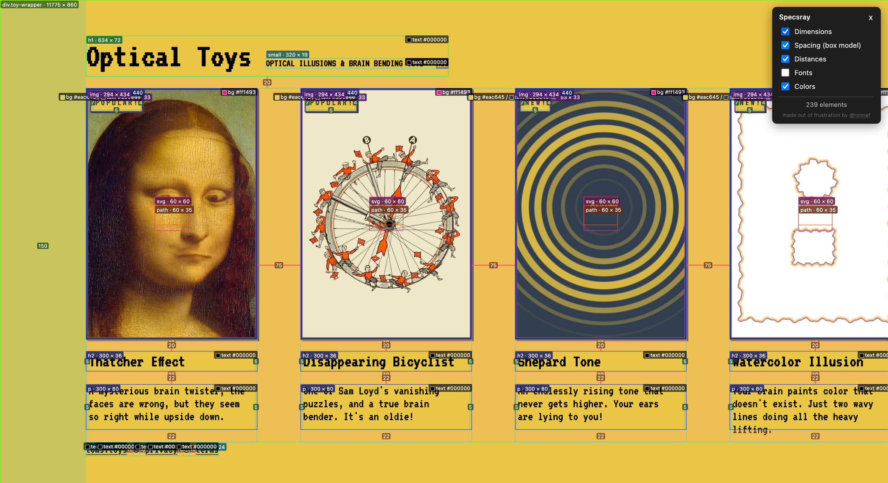

<p align="center">
  
</p>

<h1 align="center">Specsray</h1>

<p align="center">
  See the measurements behind any page. All at once.
</p>

<p align="center">
  <a href="https://chromewebstore.google.com/detail/specsray-see-spacing-gaps/feaadcblkpfmlgioenakfbpeompkabfd"></a>
  &nbsp;
  <a href="https://addons.mozilla.org/en-US/firefox/addon/specsray/"></a>
</p>

<p align="center">
  Prefer a bookmarklet? <a href="#bookmarklet">Get started here</a>.
</p>

---

Specsray overlays dimensions, spacing, distances, fonts, and colors directly on a page. Toggle it on, read the numbers, toggle it off.



<p align="center"><sub>Specsray in action on Optical Toys, with dimensions, spacing, distances, and colors enabled.</sub></p>

## What you can see

| Layer | Measurements |
| --- | --- |
| Dimensions | Element width and height |
| Spacing | Padding, margins, and flex/grid gaps in pixels |
| Distances | Space between sibling elements |
| Fonts | Typography details |
| Colors | Text and background colors |

## Get started

### Bookmarklet

1. Download or clone this repository and open [install.html](install.html) locally in your browser.
2. Drag the Specsray button to your bookmarks bar.
3. Open a page and click the bookmark to show the overlay. Click it again to remove it.

### Browser extension

Install Specsray from your browser's extension store, then click its toolbar icon to toggle the overlay.

- **Chrome:** [Install from the Chrome Web Store](https://chromewebstore.google.com/detail/specsray-see-spacing-gaps/feaadcblkpfmlgioenakfbpeompkabfd).
- **Firefox:** [Install from Firefox Add-ons](https://addons.mozilla.org/en-US/firefox/addon/specsray/).

For local development, load the `extension/` folder unpacked in Chrome or temporarily in Firefox. See the [extension guide](extension/README.md) for the full install and signing notes.

## Build

`overlay.js` is the source of truth. Everything else is generated from it:

```sh
node build.mjs
```

This minifies `overlay.js` into `overlay.min.js` (via terser), builds `bookmarklet.txt`, patches the bookmarklet link and textarea inside `install.html`, and copies the overlay into `extension/overlay.js`.

To package the extension into store-ready zips (separate manifests for Firefox and Chrome, since they don't agree on how `background` should be declared):

```sh
node extension/build.mjs
```

Zips land in `extension/web-ext-artifacts/` (gitignored).

## Development and verification

`fixtures/` holds a small set of layout edge cases (body margins, relative margins, edge-flush elements, exact viewport sizing) plus a measurement harness (`measure.js`, `run-fixture.js`) used to check one guarantee: the overlay never changes page geometry.

It works by snapshotting scroll dimensions and every element's bounding rect before injecting the overlay, injecting it, then snapshotting again and diffing. If the overlay adds a pixel of scroll or nudges a single rect, the diff shows it. This matters because an overlay that's supposed to measure a page has no business changing what it measures.

`test.html` is a general playground page for manually exercising all the layers together.

## License

[MIT](LICENSE)
